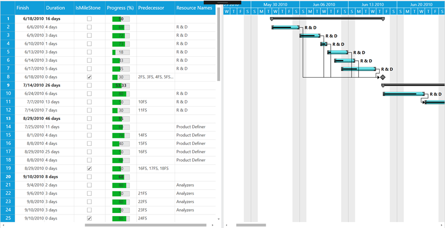

# How-to-show-a-progress-bar-in-GanttGrid-column-in-WPF-GanttControl
This article explains how to show the progress bar in a specific column of Syncfusion WPF Gantt control as shown below image.
 
 

This can be achieved by using the DataTemplate of the GanttGrid GridTreeColumn in the Loaded event as per in below code snippet.

[XAML]

```
    <Window.Resources>

        <DataTemplate x:Key="progressTemplate">
            <Grid>
                <ProgressBar x:Name="progressBar"   
                                Visibility="Visible" Minimum="0" Maximum="100" Width="50" Height="15"
                               Value="{Binding Path=CellBoundValue, Mode=TwoWay}" />
                <TextBlock Text="{Binding ElementName=progressBar, Path=Value}" HorizontalAlignment="Center" VerticalAlignment="Center" />
            
            </Grid>
        </DataTemplate>
    </Window.Resources>
   
    <Grid>
        <sync:GanttControl x:Name="Gantt"
                               ItemsSource="{Binding TaskCollection}"
                               ResourceCollection="{Binding ResourceCollection}"
                               VisualStyle="Metro"
                               Loaded="Gantt_Loaded"
                               >
            <sync:GanttControl.TaskAttributeMapping>
                <sync:TaskAttributeMapping  TaskIdMapping="TaskId"
                                                TaskNameMapping="TaskName"
                                                StartDateMapping="StartDate" 
                                                ChildMapping="Child"                                            
                                                FinishDateMapping="FinishDate"
                                                DurationMapping="Duration" 
                                                MileStoneMapping="IsMileStone"
                                                ProgressMapping="Progress"
                                                PredecessorMapping="Predecessor"
                                                ResourceInfoMapping="Resources"/>
            </sync:GanttControl.TaskAttributeMapping>
        </sync:GanttControl>
    </Grid>
```
[C#]

```
        private void GanttGrid_Loaded(object sender, RoutedEventArgs e)
        {
            var progressColumn = Gantt.GanttGrid.Columns[6];
            progressColumn.StyleInfo = new GridStyleInfo();
            progressColumn.StyleInfo.CellType = "DataBoundTemplate";
            progressColumn.StyleInfo.CellItemTemplateKey = "progressTemplate";

        }
```
## See also

[How to add custom tooltip to Gantt](https://help.syncfusion.com/wpf/gantt/customtooltip)
 
[How to define your own schedule for Gantt to track the progress of projects](https://help.syncfusion.com/wpf/gantt/custom-schedule)
 
[How to differentiate the dates of holidays](https://help.syncfusion.com/wpf/gantt/holidays-customization)

